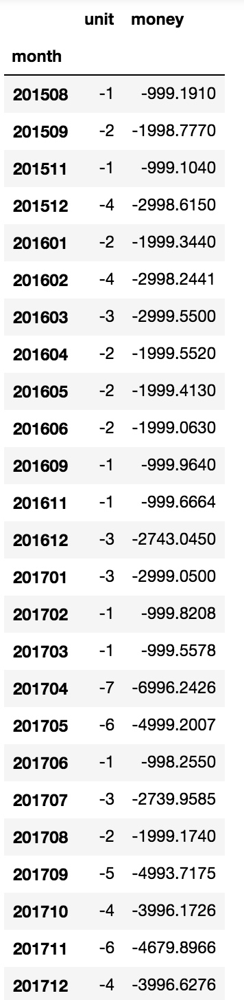
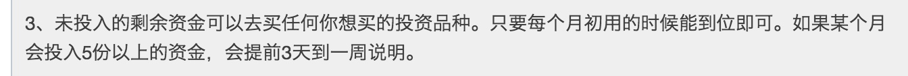
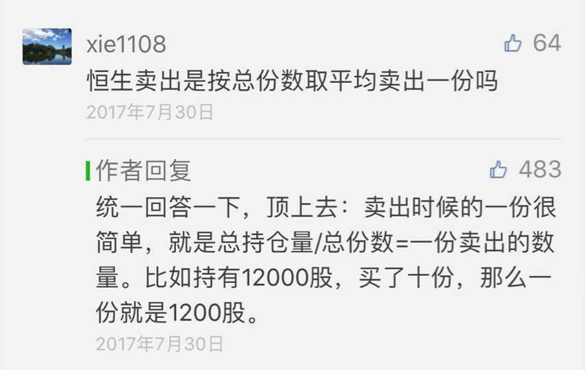

# longwin

第三轮的长赢计划发布在了[且慢](https://qieman.com/longwin/index)上, 截止2018-01-08, 用 XIRR 计算出的年化收益为: 16.08%.
和且慢有所不同, 我是用第一个交易日 2015-08-03 作为项目开始时间, 项目截至 2018-01-08 已运行 889 天.

## 每月投入金额
unit 为份数, 每份设定为 1000 元, money 为实际交易金额, 负号表示买入.

## 买入资金来源

## 卖出份额计算规则

摘自: https://mp.weixin.qq.com/s?__biz=MzIwMTIzNDMwNA==&mid=2653408564&idx=1&sn=16e1b133e361684c3c021647a25c4198

